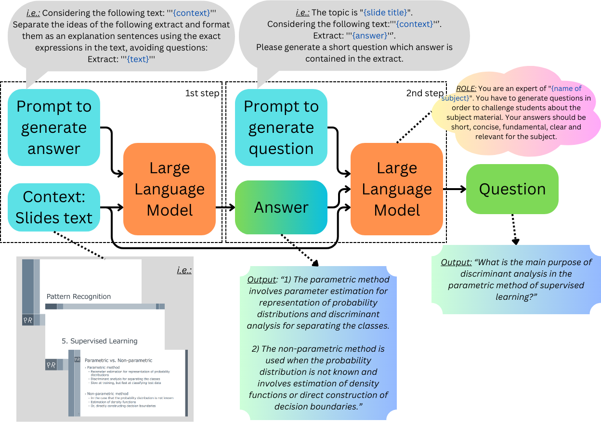

# Question-Answer Generation Pipeline

This project generates questions and answers from PDF lecture slides using different AI models.

It is also a supplementary material for the following conference paper:

Ivo Lodovico Molina, Valdemar Švábenský, Tsubasa Minematsu, Li Chen, Fumiya Okubo, and Atsushi Shimada.\
**Comparison of Large Language Models for Generating Contextually Relevant Questions**.\
In 19th European Conference on Technology Enhanced Learning (ECTEL 2024).

## How to cite

If you use or build upon the materials, please use the BibTeX entry below to cite the original paper (not only this web link).

```bibtex
@inproceedings{Molina2024comparison,
    author    = {Lodovico Molina, Ivo and \v{S}v\'{a}bensk\'{y}, Valdemar and Minematsu, Tsubasa and Chen, Li and Okubo, Fumiya and Shimada, Atsushi},
    title     = {{Comparison of Large Language Models for Generating Contextually Relevant Questions}},
    booktitle = {Proceedings of the 19th European Conference on Technology Enhanced Learning},
    series    = {ECTEL '24},
    editor    = {Mello, Rafael Ferreira and Rummel, Nikol and Jivet, Ioana and Pishtari, Gerti and Ruipérez Valiente, José A.},
    location  = {Krems, Austria},
    publisher = {Springer},
    month     = {09},
    numpages  = {6},
}
```

## Contents

- [Overview](#overview)
- [Setup](#setup)
  - [Requirements](#requirements)
  - [Installation](#installation) 
- [Usage](#usage)
- [Code Structure](#code-structure)
- [Models](#models)
  - [Llama 2 13B](#llama-2-13b)
  - [GPT-3.5 Turbo](#gpt-35-turbo)
  - [Flan-T5-XXL](#flan-t5-xxl)  
- [Results](#results)
- [Contributing](#contributing)

## Overview



The workflow follows these steps:

1. Extract text from PDF slides
2. Generate answers from slide text using Llama 2 
3. Generate questions for each answer using Llama 2
4. Generate additional questions using GPT-3.5 Turbo
5. Generate additional questions using Flan-T5-XXL
6. Save question-answer pairs to JSON file

The code provides examples for generating questions from a set of sample lecture slides on Pattern Recognition.
(These slides are not included in this repository.)

## Setup

### Requirements

- Python 3.10+
- PyTorch
- Transformers
- OpenAI API key
- Hugging Face auth token

### Installation

Clone the repo:

```
git clone https://github.com/limu-research/qa-generator-pipeline-aied2024.git
cd qa-generator-pipeline-aied2024
```

Install requirements:

```
pip install -r requirements.txt
```

## Usage

Run the sections of the notebook `workflow.ipynb` in order:

1. `Llama 2 13B-Chat Generation` - Extract text from PDFs, generates the list of answers and the first set of question generated by Llama 2 13B-Chat model, and it saves into a JSON file 
2. `GPT 3.5 Turbo Generation` - Reads the answers from the JSON file, generates questions for each one using the GPT 3.5 Turbo model and adds the new questions into the JSON file 
3. `Flan T5 XXL Generation` - Reads the answers from the JSON file, generates questions for each one using the Flan T5 XXL model and adds the new questions into the JSON file

Set the `OPENAI_API_KEY` and `HF_AUTH_TOKEN` environment variables before running.

## Code Structure

- `pdf_slides/` - Folder containing sample PDF slides 
- `workflow.ipynb` - Notebook to extract text from PDFs, generate Q&A pairs with the LLMs
- `qa_pairs.json` - JSON file containing generated question-answer pairs
- `requirements.txt` - Python requirements

## Models

### Llama 2 13B

[Llama 2](https://huggingface.co/models/meta-llama/Llama-2-13b-chat-hf) is used to generate answers and initial questions from the PDF slide text.

### GPT-3.5 Turbo 

[GPT-3.5 Turbo](https://platform.openai.com/docs/models/gpt-3.5-turbo) is used to generate additional questions for each answer. 

### Flan-T5-XXL

[Flan-T5-XXL](https://huggingface.co/google/flan-t5-xxl) also generates additional questions for each answer.

## Results

The output is a JSON file `qa_pairs.json` containing the generated question-answer pairs.

See also the `/figures` folder for the analysis of the answer distributions for the paper.

## Contributing

Pull requests are welcome! Feel free to open an issue for any enhancements or bugs.
